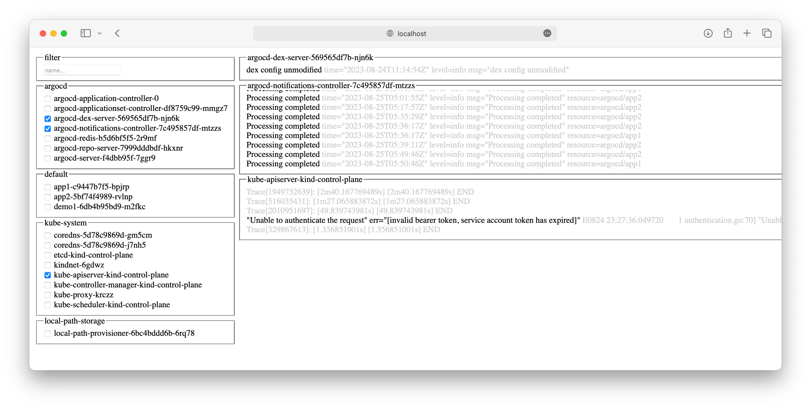

# Lens

**Problem:** I am playing with yet another tool (this time ArgoCD), somehow it does not work, I do not know where to look for error details, starting jumping between logs of pods in differrent namespaces is like a night mare, not only it is hard to read them it is also hard to simple iterate over all wanted pods

There is pretty cool project that partially may solve this issue - [Lens](https://k8slens.dev)

But, it does not allow me to see logs of multiple pods side by side, it is not friendly for ephemeral clusters (aka while playing I am using kind and recreating clusters each time from scratch)

Thats why decided to have fun and build this



> Yeah, I know, UI is "awesome" :)

It will print list of all pods in your cluster, you may select wanted pods, and their logs will be "streamed" to your browser.

We are trying to highlight message and print it first in each logs line, which makes it dramatically easier to read them.

## Quick start

It is required to have installed and preconfigured [kubectl](https://kubernetes.io/docs/tasks/tools/)

```bash
wget https://raw.githubusercontent.com/mac2000/lens/main/index.html
kubectl proxy -w .
open http://localhost:8001/static/index.html
```

## How it works

```bash
kubectl proxy -w .
```

will serve not only proxy but current directory under `/static/` path as well, which means you can have your `index.html` being served

and because it is all server on same origin from our browser we may call something like:

```js
fetch("/api/v1/pods")
  .then((r) => r.json())
  .then((r) => r.items.map(({ metadata: { namespace, name } }) => ({ namespace, name })))
  .then(console.table);
```

unfortunately I was not able to watch anything using `WebSockets` (seems like it is an issue with proxy itself but not sure here)

but thankfully there is a good old long pooling available so we can do something like:

```js
fetch("/api/v1/namespaces?watch=true").then((r) => console.log("TODO: process long pooling request"));
```

the key thing here is that request wont be closed and will be spinning forever, you can see that in network tab of developer tools

kubernetes will send new line delimited json events to us as they appear

it will be something like:

```ndjson
{"type":"ADDED","object":{"version":"v1","kind":"namespace","metadata":{"name":"demo"}}}
{"type":"DELETED","object":{"version":"v1","kind":"namespace","metadata":{"name":"demo"}}}
```

where each object will have:

- `type` either `ADDED` or `DELETED` or `MODIFIED`
- `object` json representation of observed object

BTW technically speaking all Kubernetes controllers and operators work exactly by doing this, aka look for added even for your CRD and create something

To read new line delimited json we gonna need little bit of hacky callback to process response, here is and example of how it may look like:

```js
fetch("/api/v1/namespaces?watch=true").then(async (response) => {
  const reader = response.body.getReader();
  const decoder = new TextDecoder();
  let result = await reader.read();
  let buffer = "";
  while (!result.done) {
    buffer += decoder.decode(result.value);

    let idx = buffer.indexOf("\n");
    while (idx !== -1) {
      const text = buffer.substring(0, idx);
      try {
        const message = JSON.parse(text);
        console.log(message);
      } catch (error) {
        console.warn(text);
      }
      buffer = buffer.substring(idx + 1);
      idx = buffer.indexOf("\n");
    }

    result = await reader.read();
  }
});
```

To cancel requests we may want to use [AbortController signals](https://developer.mozilla.org/en-US/docs/Web/API/AbortController/signal)

TLDR:

```js
const controller = new AbortController();

fetch("/whatever", { signal: controller.signal }).then(process);

document.getElementById("cancel").addEventListener("click", () => {
  controller.abort();
});
```

It is similar to `CancellationToken` from dotnet and `context.WithCancel` from golang

Now just need to wireup everything and finally get it up and running

At the very end goals was:

- keep it dependency free
- no build/transpile steps
- single file distribution
- easy start
- having fun

Things to improve:

- get rid of react
- clever log highlighter/printer

> Note: did you know that for any kubectl command you may add `-v=8` to see what API calls are made under the hood, for example: `kubectl get po -A -v=8`

Nice trick for an alias

```bash
alias lens='(sleep 1; open http://localhost:8001/static/index.html &); kubectl proxy -w /Users/mac/github.com/mac2000/lens/'
```

Or you can do something more cool like [this](https://www.reddit.com/r/kubernetes/comments/160r9po/comment/jxowaxp/?utm_source=share&utm_medium=web2x&context=3)
